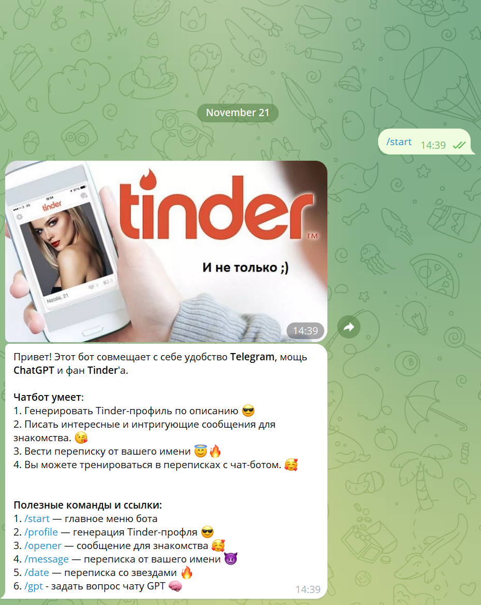

# WizMessenger

## Descriptions
Телеграм-бот - это виртуальный пользователь Telegram, с которым можно “общаться”
как с живым человеком. Перед нами – очень интересная задача. Мы должны создать “умного” бота, который умеет:
вести диалог
практиковаться в свиданиях
генерировать адекватные и прикольные описания для сайтов знакомств
раздавать советы при переписке на сайте знакомств.
Чтобы бот этому всему научился и выглядел умным, мы прикрутим к нему ChatGPT.

## Skills
- Telegram
- Java

## Screenshots

## TODO

